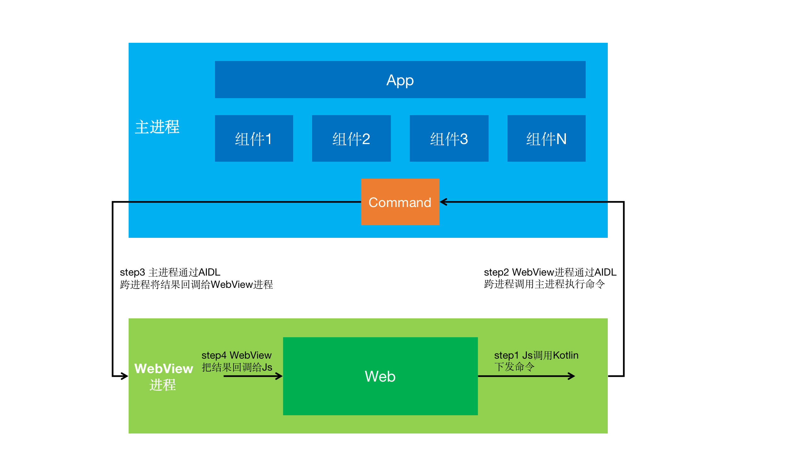

# MentosWeb

**一款轻巧而又功能强大的Android WebView，使用命令模式，@AutoService实现业务层，AIDL跨进程通信，支持JsBridge，具备强大的扩展能力。**

#### 功能

* MentosWeb独立进程，使用AIDL通信，降低OOM。
* 支持JsBridge，在业务层实现接口即可和js进行交互，扩展性极强。
* 支持进度条、下拉刷新、定制背景(开发中)、定制状态栏(开发中)、状态页切换(开发中)。

#### 演示

#### 使用

#### 架构

#### 类图

